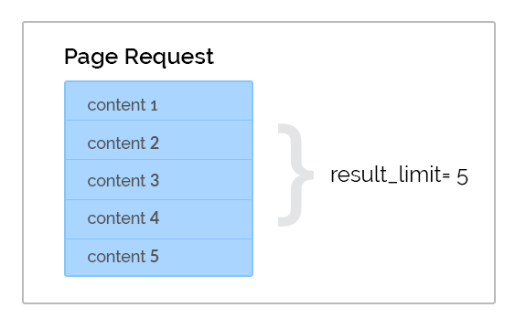
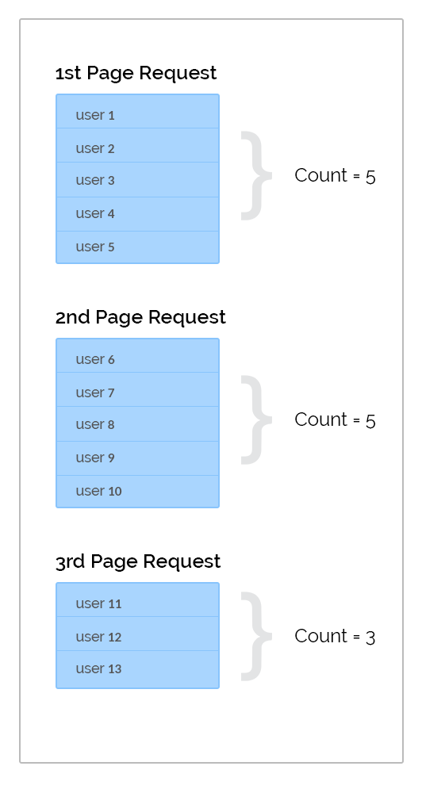
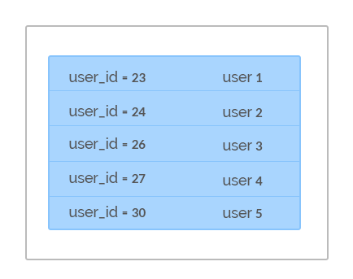
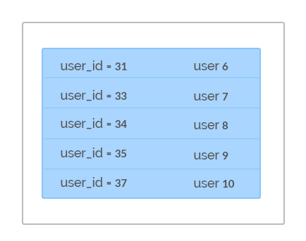

Pagination
==========

The DronaHQ REST APIs contain methods which return a list of content for any given resource. Such lists often grow very large, so there are limits set in terms of how much of content an application may fetch via a single request. Applications must therefore iterate through the resulting lists using pages in order to be complete and accurate.

Because of the sheer volume of data on the DronaHQ platform, standard paging techniques are sometimes not as effective. Below is an example of how DronaHQ developers can adopt a practice that will ensure efficient and accurate processing a pages or lists.

DronaHQ REST API's **list endpoints** help applications to implement pagination through:

	- max_id
	- result_id

Note that the example below refers to the |GET Users| method in order to demonstrate the pagination concepts.

.. |GET Users| raw:: html

   <a href="api-documentation-plugin-rest-users.html" target="_blank">GET Users</a>
   
The 'result_limit' parameter
------------------------------
DronaHQ REST API's **list endpoints** allow an application to set the size of a page in the response through the result_limit parameter. 

The 'max_id' parameter
-----------------------
All applications must read any list relative to the IDs of the content. This is achieved using the **max_id** request parameter. To use **max_id** correctly, an application's first request to a list endpoint should have the value of **max_id** set as 0 (zero). When processing the request and subsequent responses, the application must keep a track of the highest ID from the contents received. This ID should be passed as the value of the **max_id** parameter for any subsequent requests, which will then return a list of content with IDs higher than the value of the **max_id**. 

Example
--------
In the |GET Users| API **maxuid** in the query string parameter serves as the **max_id** and ulimit serves as the result_limit of the API.

Let's assume an application has set **ulimit = 5**. This implies that on each request the |GET Users| API response would contain a user list with a maximum of 5 users. So for a total user count of 13 the subsequent page response would be as depicted below:

   
Setting  **ulimit = 5** the response for the 1st |GET users| API request would be -

As we can see that the highest ID in the response id 30, the **maxuid** for the second request is set as **maxuid = 30**, which would result in a response like this.

Likewise, the subsequent requests are made by setting the value of **maxuid**  to the highest ID of the content already processed.
