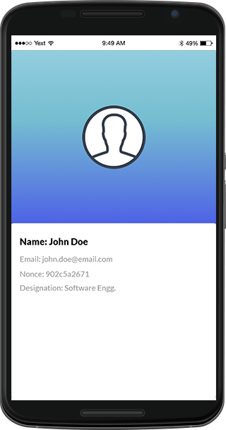

.. _quick-start:

Quick Start
===========

The purpose of Quick Start is to help you build a very simple HTML5 web application and deploy it inside the DronaHQ Client App container. This helps developers establish a basic foundation for developing and deploying apps on the DronaHQ platform. 

As mentioned before, in the |DronaHQ SDK Overview| guide, then DronaHQ platform's SDK consists of two major segments:

	- Device APIs
	- REST APIs. 

.. |DronaHQ SDK Overview| raw:: html
	
	<a href="sdk-overview.html" target="_blank">DronaHQ SDK Overview</a>
	
While DronaHQ Rest APIs are to be consumed via HTTP requests,  using the Device APIs requires your application to include dronahq.js in the header section of your HTML page.

.. code:: html
	
	
	
You can get the latest copy of dronahq.js from our |GitHub repository| , and place it anywhere in your application's resources. 

.. |GitHub repository| raw:: html
	
	<a href="https://github.com/dronahq" target="_blank">GitHub repository</a>

The following properties allow you to detect what platform your micro-app is running on, if you need to add platform specific features/content in your micro-app.

	- **DronaHQ.onIos:** returns *true* if the micro-app is running inside DronaHQ container on iOS.
	- **DronaHQ.onAndroid:** returns *true* if micro-app is running inside DronaHQ container on Android.
	- **DronaHQ.onWindowsPhone:** returns *true* if micro-app is running inside DronaHQ container on Windows Phone.
	- **DronaHQ.onWeb:** returns *true* if micro-app is running inside DronaHQ Web App on an HTML5 compliant browser.

Note that the DronaHQ Client must be fully initialized before making any Device API calls.

.. code:: javascript

	document.addEventListener('deviceready', function(){
		//Intialize your app
	}, false);

With this in mind, lets start by making a simple application that displays the details of on signed-in user.

   
**Steps to Build**

.. |source code| raw:: html
	
	<a href="https://github.com/dronahq/samples/tree/master/the-user-sso" target="_blank">source code</a>
	
You can follow the steps mentioned below or get the |source code| from the github repository.
	
	- Step 1: Create the app project folder "the-user-sso". This will be the application's root directory.
	- Step 2: Add index.html, the web page that hosts the application, to the application's root directory.

	.. code:: html
	
		<!DOCTYPE html>
		<html xmlns="http://www.w3.org/1999/xhtml">
			<head>
				<title>User profile - DronaHQ</title>
				<meta name="viewport" content="width=device-width, initial-scale=1, maximum-scale=1" />
				<link rel="stylesheet" href="css/semantic.min.css" type="text/css" />
				<link rel="stylesheet" href="css/app.css" type="text/css" />
			</head>
			<body>
				

					

						

							
						

					

					

						

							

								

									Name: {{user_name}}
								

								

									Email: {{user_email}}
								

								

									Nonce: {{nonce}}
								

								

									Designation: {{user_desig}}
								

							

						

					

				

			
			
			
			
			

			<!-- App -->
			
			</body>
		</html>

	- Step 3: Add the directories named 'js' and 'css' to the application's root directory. These will contain all your javascript files and style-sheets respectively.
		
		- Add app.js in the directory 'js'

	.. code:: javascript

		/* global $, DronaHQ, Identicon */

		var App = function () {
			var _getDefaultImage = function (inputHash) {
				// set up options
				var hash = 'myUnicodeUsername!' // Any unicode string
				var options = {
					background: [255, 255, 255, 255], // rgba white
					margin: 0.2, // 20% margin
					size: 290 // 420px square
				}

				// create a base64 encoded PNG
				var data = new Identicon(hash, options).toString()

				return 'data:image/png;base64, ' + data;
			}

			var _initUser = function () {
				DronaHQ.user.getProfile(function (uData) {
					console.log('User ID: ' + uData.uid)
					$('#spUserName').text(uData.name)
					$('#spUserEmail').text(uData.email)
					if (uData.designation) {
						$('#userDesg').removeClass('hide')
						$('#spUserDesg').text(uData.designation)
					}
					if (uData.profile_image) {
						$('#imgUserProfile').attr('src', uData.profile_image)
					} else {
						$('#imgUserProfile').attr('src', _getDefaultImage(uData.uid))
					}
					$('#spUserNonce').text(uData.nonce)
				})
			}

			return {
				init: function () {
					_initUser()
				}
			}
		}

		$(document).on('deviceready', function () {
			var objApp = new App()
			objApp.init()
		})

	- Step 4: Include all files in the application's root directory to a .ZIP file.
	- Step 5: |Deploy your application| as a .ZIP package named "**MyQS**".

Now open the client app, and on the homescreen a  micro-app icon named "**MyQS**" would be available. Click the micro-app to view your application.

You can also get started by trying out more of our |sample applications|.

.. |sample applications| raw:: html

   <a href="https://github.com/dronahq/samples" target="_blank">sample applications</a>
   
.. |Deploy your application| raw:: html

   <a href="micro-app-deployment.html" target="_blank">Deploy your application</a>

