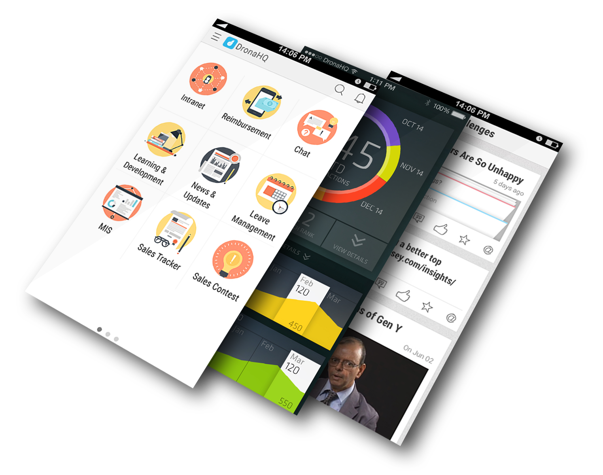
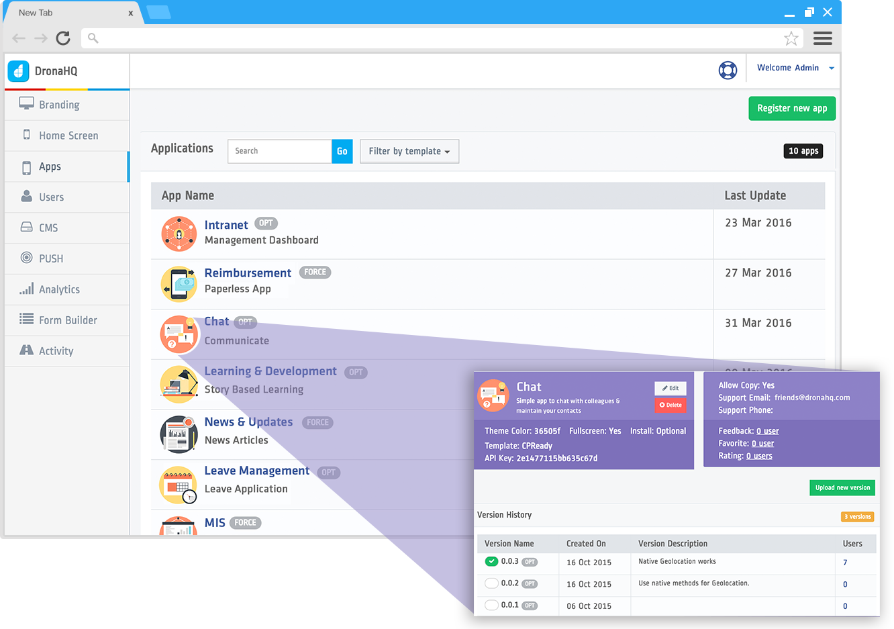

System Architecture
===================

The DronaHQ platform comprises of four major  components. 
	- :ref:`native-dronahq-container-app`
	- :ref:`dronahq-micro-apps`
	- :ref:`dronahq-console`
	- :ref:`dronahq-sdk` 
	
The following diagram shows a high-level overview of the DronaHQ system architecture.

.. image:: images/sys-architecture.png
   :height: 600px
   :width: 500 px
   :scale: 100 %
   :align: center

.. _native-dronahq-container-app:

The DronaHQ Container App
--------------------------------

The DronaHQ Container App is the main app that gets deployed to the user's device. The DronaHQ Container App is supported on iOS, Android, and Windows Phone devices. For users that are on devices other than iOS, Android, and Windows Phone, we also provide a Web platform that could be accessed via any HTML5 compliant browser on the user's device. 

The DronaHQ platform comes with a number of pre-built modules, so that you can focus on quickly building a highly functional and great looking micro-apps for your end users.

	- **User Management**: The user management module handles the user authentication process via DronaHQ IdP or your own identity provider using SAML 2.0 or OAuth 2.0 protocol. With the user management module, you also get a basic profile screen for users where they can manage their personal information such as a profile image, designation, etc.
	- **Micro-app Management**: The DronaHQ platform treats all  apps and content deployed in the native container as a micro-app. The micro-app management module helps with the deployment and upgrade of any app/content that is made available to users within the container app. The micro-app manager also has a capability to update any micro-app on a user's device in the background, so that the users are always up-to-date and they have a seamless experience while using their micro-apps.
	- **Notification Manager**: The notification manager handles any push notifications sent to the user from the micro-apps. The container app also comes with a pre-built unified inbox of all such notifications where users can easily access all their current and previous notifications. 
	- **WebView Runtime**: A key component of the DronaHQ container app is a high-performance runtime (based on WebView) to run your micro-apps. This runtime provides similar experience to all your users irrespective of the OS and their versions. The WebView runtime also supports remote debugging of the micro-apps for developers.
	- **Security Manager**: The security manager is responsible for adding the layer of security to the container app. The security manager supports all enterprise grade security features such as passcode and fingerprint (touch id) authentication for preventing any unauthorized access. It also provides functionality for remote data wipe in case of device loss. The security manager also provides a secure storage module for the micro-apps, which can be utilized via the DronaHQ SDK.

.. _dronahq-micro-apps:
	
The DronaHQ Micro-apps
----------------------

The DronaHQ Micro-apps are the applications that run inside the DronaHQ native containers. Once deployed, the micro-apps are delivered to the container app as a web application or pure content. The micro-apps can be deployed as a zipped package of your application code base, or you could simply host your application on an application server and provide a web URL to the DronaHQ management console. Note that micro-apps that are deployed as zipped packages need a file (index.html) that references all the CSS, JavaScript, image, or any other resources necessary to run the application. The micro-apps are executed in the WebView runtime of the DronaHQ container app.

   
DronaHQ also supports integration with other native apps already installed on the user's device. Due to technology limitations, only a basic integration with external natives apps is possible as of now.

.. _dronahq-console:
	
The DronaHQ Admin Console
-------------------------------

The DronaHQ Admin Console is a centralized management console that helps deploy, manage, and analyze micro-apps and content on user's devices. The console provides you with features the ability to:

	- Deploy and manage micro-apps
	- Create and manage users and groups
	- Configure and customize the container app
	- Provision and revoke access to micro-apps
	- Analyze and review usage statistics

The key sections of the management console include:

	- **App Management**: to deploy and manage all your micro-apps. It also provides a per-app usage analysis.
	- **User Management**: to manage the end-users. It allows you to invite, activate/deactivate users, and analyze their usage patterns.
	- **Catalog Management**: to create and manage your micro-app catalogs, which can then be assigned directly to individual users or a group of users.
	- **Settings & Policies**: to help set corporate policies such as screenshot/copy prevention, per-user device limits, etc. The settings area also provides easy-to-use features for customizing home screens, adding logos, and the likes for your custom branding needs.

.. _dronahq-sdk:

The DronaHQ SDK
---------------

The DronaHQ platform provides a powerful JavaScript SDK and set of REST APIs to help developers build micro-apps faster using HTML5  and associated technologies. The DronaHQ JavaScript SDK is built on top of |Apache Cordova|, a popular mobile framework that allows cross-platform development, and provides access to device native features using JavaScript APIs. So if you are familiar with Apache Cordova, you are already a few steps ahead. 

The purpose of DronaHQ SDK  is to provide the core building blocks that help developers build applications (aka micro-apps) faster. Developers own the look and feel, the UI interactions, and the business logic of the micro-app, and you can decide to use any HTML5 framework/library for it. The DronaHQ platform takes care of the security, and overall management your container app, micro-apps, and the users.

The DronaHQ SDK has two main components:

	- **dronahq.js**: A JavaScript library built on top of Cordova, which combines a core Cordova device APIs and a set of well known Cordova plugins, along with DronaHQ platform specific methods that help you make your app secure and allow you to use native device features.
	- **REST APIs**: A set of DronaHQ platform APIs that allows developers to program their micro-apps for operations such as sending notifications, getting a list of users, or other similar functions detailed out in their respective sections.

.. |Apache Cordova| raw:: html

   <a href="https://cordova.apache.org/" target="_blank">Apache Cordova</a>

